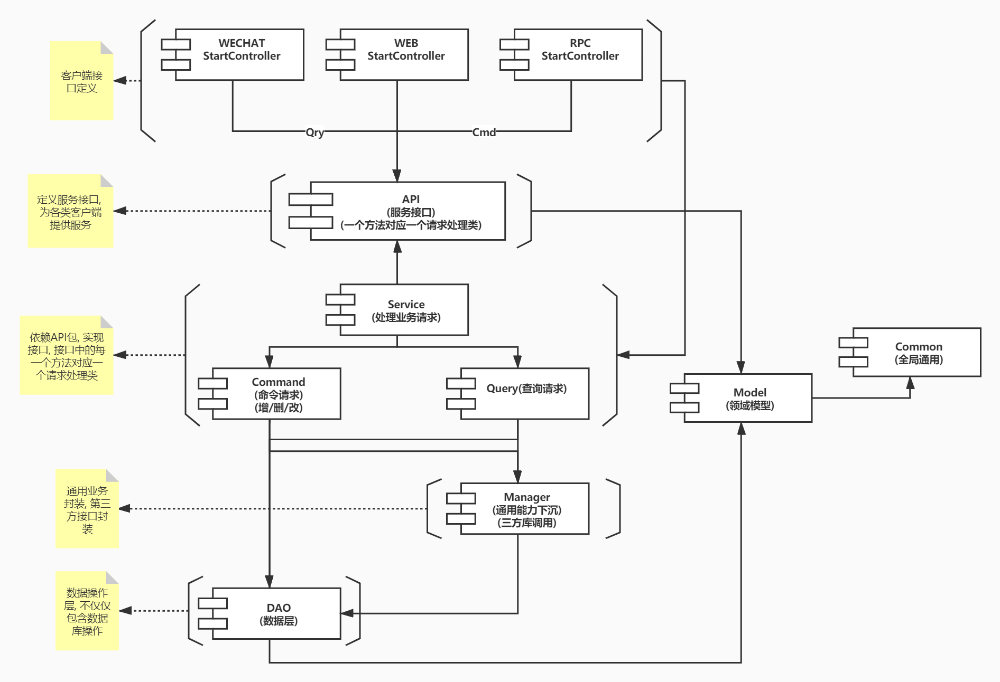
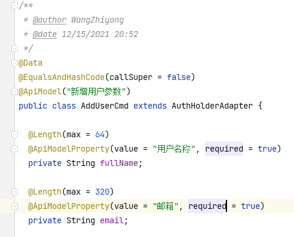
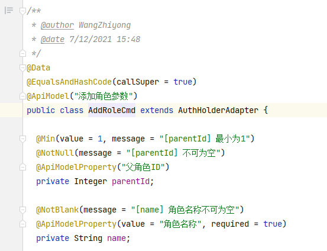
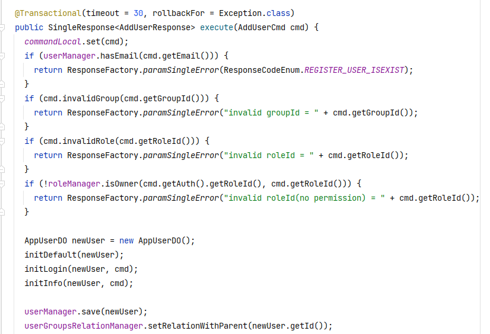
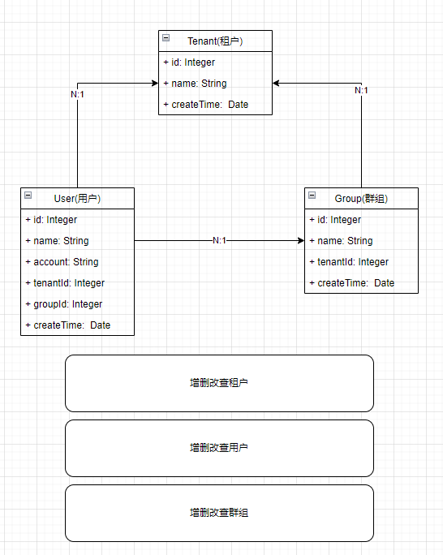

# [ spec4j ] 一个面向复杂业务和需长期迭代的工程规范标准

---

**原则: 可迭代 > 可读性 > 初期效率**

spec4j 指导你去构建一个合理的和可持续扩展业务的项目结构, 主要目标:

- 解决什么类归属到什么分层的困扰
- 解决服务层大量的私有方法问题
- 解决一个实体走天下带来的扩展问题
- 解决服务内部接口调用问题
- 解决如何沉淀通用业务问题

> 本规范并不会增加初期开发的效率, 反而会为初期创建项目结构和对应的功能增加复杂度和繁琐度, 但是当我们将这些结构都构建好后, 对后期的维护和功能扩展是非常有帮助的,
> 我认为复杂的业务不应该为了增加初期的一点效率而去过度简化设计

## 主要使用的技术栈

以下技术栈主要用于为了方便描述规范而使用, 当然也可以切换为其他的技术栈来匹配到对应的规范上即可

- springboot
- mybatis-plus
- openfeign
- swagger

## 项目分层

所有包的创建规则要以业务开头: `{分层}.{业务}.[子业务],{子分层}`, 模型层中的子分层较多, 但不意味着所有的业务都需要 创建出完整的子分层, 如果业务量不大, 可以没有子分层,
只需要保证类的规范即可, 所有的模型都可以有对应的行为, 即在类中增加方法, 领域模型需要包含具体的业务方法, 让和业务有关的方法全部集中到领域模型层

| 分层               | 名称      | 作用                          | 依赖           |
|:-----------------|---------|-----------------------------|--------------|
| adapter          | 适配层     | 适配各个端的服务层, 如: 小程序, PC, 内部接口 | api, service |
| api              | 接口层     | 定义业务接口                      | model        |
| service          | 服务层     | 实现具体的业务操作                   | manager, api |
| service-query    | 服务层-查询层 | 处理复杂查询业务的单独处理层              | service      |
| service-command  | 服务层-命令层 | 处理复杂增删改业务的单独处理层             | service      |
| manager          | 管理层     | 沉淀通用业务能力                    | dao          |
| dao              | 数据层     | 访问数据库                       | model        |
| model            | 模型层     | 所有的模型全部存放与此, 用于对外提供或内部调用    | common       |
| model-event      | 模型层     | 事件类分层, 类以xxxEvent 结尾        | common       |
| model-domain     | 模型层     | 领域模型分层, 可作为多层中的出入参          | common       |
| model-query      | 模型层     | 服务层查询参数分层, 类以xxxQry 结尾      | common       |
| model-command    | 模型层     | 服务层命令参数分层, 类以xxxCmd 结尾      | common       |
| model-param      | 模型层     | 管理层参数类分层, 类以xxxParam 结尾     | common       |
| model-dataobject | 模型层     | 数据层数据类分层, 类以xxxDO 结尾        | common       |
| model-properties | 模型层     | 配置类分层, 类以xxxProperties 结尾   | common       |
| model-enums      | 模型层     | 枚举类分层, 类以xxxEnum 结尾         | common       |
| common           | 通用层     | 通用层, 存放通用功能, 工具类, 接口等       | 无            |

## 代码规范

定义好每个分层中需要注意的编码风格, 保证统一和可维护性

### 1. 代码格式

#### 1.1 规则

规则参考Google的Java代码格式化规范, 目前各类开源组织都在使用此规则

规则地址: https://github.com/google/styleguide/blob/gh-pages/intellij-java-google-style.xml

#### 1.2 使用

编写完代码后, 养成及时的 `ctrl+alt+l` 来格式化代码, 保证代码的整洁
如果在修改历史代码, 发现历史代码未格式化时, 先进行格式化, 格式化后立即提交代码, 然后再编写自己的业务

#### 1.3 其他格式

**方法与方法之间使用一个空行换行**

**属性与属性之间使用一个空行换行**

**在方法体中如果包含多段逻辑, 可使用空行来区分**

### 2. 注释规范

**日期格式**

@date yyyy/MM/dd hh:mm:ss

**作者格式**

@author 姓名拼音

**方法及类注释**

直接在注释体中写, 不使用标识, 如`@description`等

**响应注释**

要详细描述响应的类型, 例如: 不为空时, 需要表明出来

**其他注意**

- 如果方法或类很简单, 可以不加注释
- 尽量不在方法体中写注释, 如果有复杂逻辑要写注释, 要写代码的作用, 而非代码的流程
- 好注释不代表是大量的注释, 大量的注释也会增加维护的成本
- 尽量不使用非标准的注释标识

### 3. 控制器规范

#### 3.1 URI

URI 尽量使用Restful风格来定义, 详细可以参考Restful的解释

> 参考地址: http://www.ruanyifeng.com/blog/2018/10/restful-api-best-practices.html

#### 3.2 请求和响应

请求和响应分别使用: xxxCmd或xxxQry与xxxResponse来定义, 响应对象需要使用同一的一个对象进行泛型包装

#### 3.3 参数校验

参数校验尽量使用框架自带的校验方式, 如使用注解进行非空字符长度等类似的

#### 3.4 职责

控制层可以做简单的参数校验, 参数封装和简单的响应处理工作, 所有的业务工作要转交至service进行处理

#### 3.5 异常处理

建立统一的异常处理机制, 对类似`参数异常` `内部服务异常` 等要做统一的拦截处理, 达到统一管理, 避免冗余代码

#### 3.6 注释

使用swagger等开源的接口文档管理工具来为控制层的类/方法/参数/响应值做注释处理

#### 3.7 对象引用

尽量使用Spring框架下自身封装的一些对象, 可以更优雅的实现业务

### 4. 服务层规范

#### 4.1 入/出参

服务层的入出参数, 直接使用控制器的参数来使用吗, 返回值也和控制器一样, 需要使用包装类来包装起来

#### 4.2 复杂处理

对于复杂的业务方法, 可以将业务方法转交至新的类来实现, 避免方法内部有大量的代码来处理业务, 也尽量避免在service类中有很多私有方法

#### 4.3 业务调用

服务层只能调用管理层或者dao层, 服务层之间不能相互调用, 如果有相互调用的需求, 可以将这样通用的功能下沉到管理层进行封装/实现, 保证业务接口干净, 职责清晰

### 5. 管理层规范

#### 5.1 入/出参

入参使用: xxxParam 结尾
出参使用: 领域对象

#### 5.2 分层职责

管理层主要用来下沉业务层的通用功能, 也用来组合dao层或者三方库来实现一些通用的业务

#### 5.3 调用逻辑

管理层可以调用dao层, 管理层之间也可以相互调用

#### 5.4 接口划分

管理层的类在划分时, 要按照业务的实际用途来指定类或者方法名称, 避免有抽象过高的接口, 比如: UserManager, 此接口代表着可以包含所有的用户相关的方法, 最终会导致此类越发展越大 (
前期可以放, 当达到一定量级时, 再拆分也可以, 但是会有改动成本)

### 6. 数据层规范

#### 6.1 入/出参

如果使用mybatis-plus的情况下, 可以直接使用它对外提供的一些公共方法参数的定义
否则, 此层的入参将和管理层的入参使用, 使用xxxParam结尾

出参使用xxxDO结尾

#### 6.2 方法封装

尽量使用单表进行业务操作, 当需要使用多表时, 需要避免使用Map作为出入参来对功能进行定义

#### 6.3 注释

在定义复杂的sql时, 需要增加上清晰的注释, 来标识SQL的含义

### 7. 三方库规范

#### 7.1 库引用

总的来说, 尽量减少三方库的引用, 避免程序过大, 或出现未知的问题

### 7.2 使用

在使用三方库时, 尽可能的在做一层符合业务的封装, 方面后期替换

比如, 在使用hutool工具包时, 可以使用委托方式, 进行hutool包的调用

## 演示业务

演示方向: 管理租户内的用户和群组, 演示的业务中只涵盖和分层还有规范相关的内容, 不包含鉴权或其他详细的业务操作

